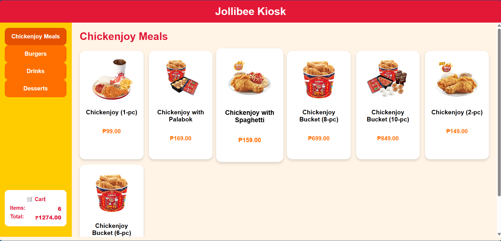
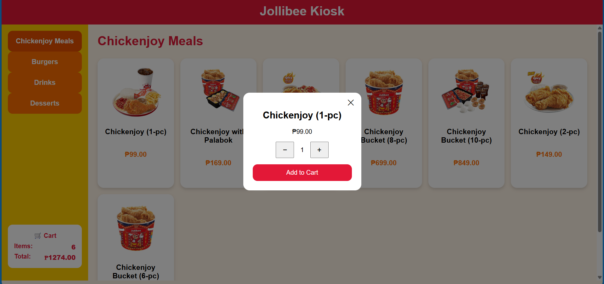

Jollibee POS System Simplified

Focus of this project:
- Microservices
- Api gateway
- Event driven architecture

Simulating the KIOS machine of the jollibee
- Customer uses the kios
- Cashier in this project will be just logs in then see the pending orders
- then the cashier will put how much is the payment given by the customer
- then marked it as completed

Feature
- Display Menu Items (jollibee food items)
- Have category selection 
--> chickenjoy meals (C1, C2, C3)
--> burgers (B1, B2, B3)
--> drinks (D1, D2, D3)
--> desserts (S1, S2, S3)

- Use choose then add to cart
- Cart have computed total (so that users already know how much they added in cart) 
- Checkout contains the totals
- Payment will be process by the Cashier account!

Microservices
- use database.sqlite (for simplicity so no need for xampp or some)
- module based stucture having module folder then inside is repository, routes, controller, services, dto, index.js
- index.js will get all the files like repository, routes etc. to be injected in the container.js
- container.js is the dependency injection site. where we inject the codes
- middleware for some needed error handlings and some etc.
- kafka folder contains the kafka producer or consumer, depends on the service need
- app.js will be the one to run 

Client
- use vanilla js with vite and spa structure
- have services to connect with the api gateway

Api Gateway
- use nginx as gateway 
- add configuration for cors so the client side can connect

Event Driven Architecture
- use kafka broker with zookeeper
- configurate in the docker with only one partitions since its just a simple 

---------------------------------------------------------------------------------------

Services needed:
Menu Service
- display menu items and category

Cart Service
- handles cart operations 
- add to cart
- remove to cart
- find item in cart
- total computation only (so user know how much before checkout)

Order service
- checkout 

---------------------------------------------------------------------------------------

Step by step building as a solo developer!

1. Microservices - build the services and make sure its working first
2. Api gateways - set up the api gateway so that its ready before the client is created
3. Client side - build the client and shape the needs depends on what the backend can provide
4. Kafka - consumer, producer and broker will be created so ensure!

---------------------------------------------------------------------------------------
Overview: 

**Menu Display:**  

**Add to Cart Display:**  

**Cart Display:**  

-------------------------------------------------------------------------------------
